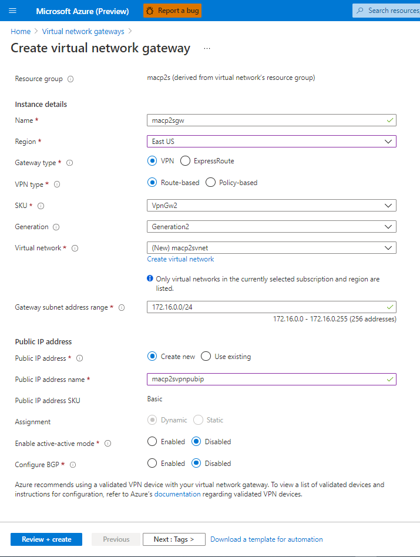

## Welcome to Jordy's Portfolio and Knowledge Share

I hope to bring lots of great content to you in the fields of IT networking and the cloud with a focus in the Azure Ecosystem.

This site will also showcase some of my personal projects and experience throughout my IT career. 

### Configure Macbook Air w/ M1 Chip as a P2S Client with Azure Virtual Network Gateway

I get the chance to work with a lot of IT professionals that take advantage of the Point-to-Site VPN offering on the Azure Virtual Network Gateway to connect their remote users into their Azure Virtual Networks. And a lot of the time these remote end-users are working with MacOS, which can be scary for some of our native Microsoft Administrators.

While helping these clients configure their point-to-site VPNs for their remote users we can run into some issues. So as I recently acquired Apple's new M1 MacBook Air, I thought it appropriate to go through the process of setting up the machine as a client on my Azure VPN and see if I am able to reach the resources in my Virtual Network. 
                    
```markdown
REQUIREMENTS

# The P2S VPN will use a certificate generated in PowerShell on a Windows Machine.

- M1 MacBook Air running MacOS Big Sur (v11.5.2)
- Root and Child Certificate w/ full chain
 Azure Resources:
- Azure Virtual Network 
- Azure VM for connectivity testing
- Azure Virtual Network Gateway (Non-Basic SKU)

```
# Provisioning Azure Resources
Start by configuring the Azure Virtual Network Gateway as a P2S VPN. This can be done in the portal using the following steps:
1. Go to the Azure Portal and at the top search for "Virtual Network Gateway" and then click "Create"
2. You will then be prompted to configure the actual gateway itself.

For more details see [GitHub Flavored Markdown](https://guides.github.com/features/mastering-markdown/).

### Jekyll Themes

Your Pages site will use the layout and styles from the Jekyll theme you have selected in your [repository settings](https://github.com/gibsonj1998/jordy.github.io/settings/pages). The name of this theme is saved in the Jekyll `_config.yml` configuration file.

### Support or Contact

Having trouble with Pages? Check out our [documentation](https://docs.github.com/categories/github-pages-basics/) or [contact support](https://support.github.com/contact) and we’ll help you sort it out.


**Bold** and _Italic_ and `Code` text

[Link](url) and 
